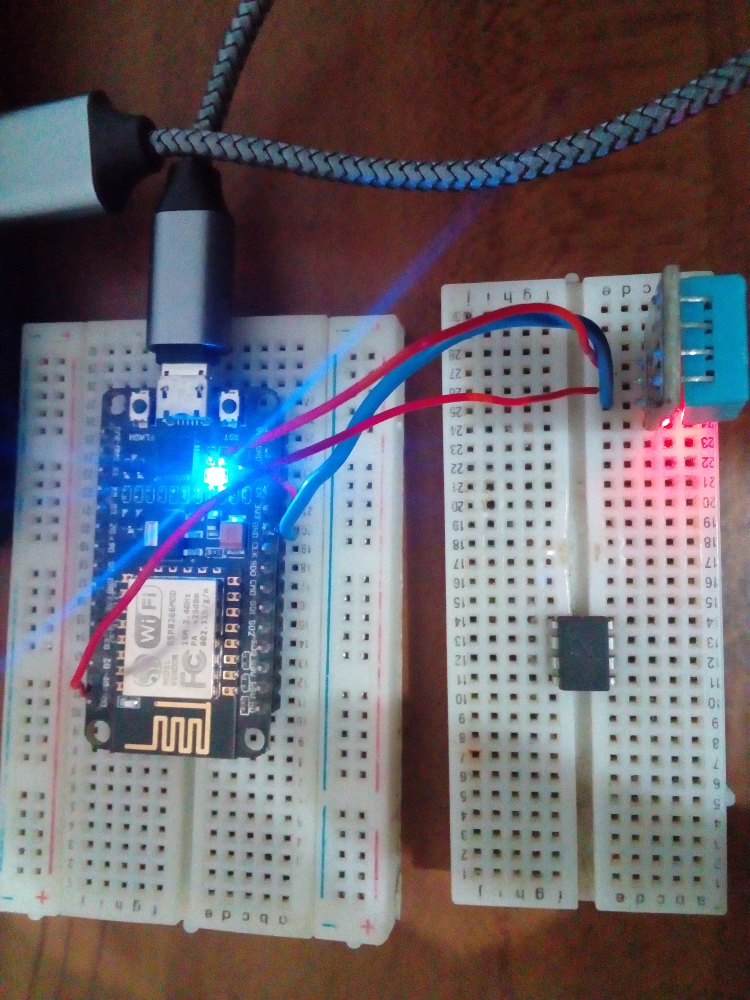

# esp8266-DTH11

## Intrucciones

###### 1.-instalar python
>descargar he instalar python
>https://www.python.org/downloads/

###### 2.-instalar platformio
>Precionar inicio escribir cmd y abrir, en la consola escribir \n
>pip install platformio -U

