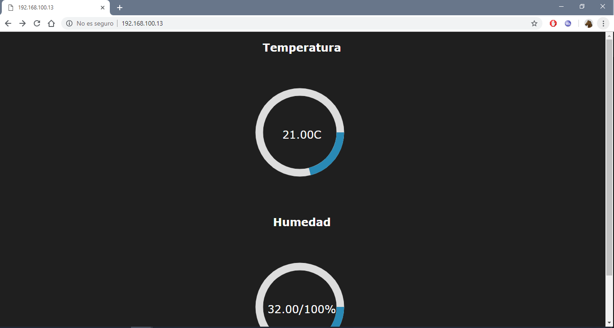

# esp8266-DTH11

## Intrucciones

###### 1.- Instalar python_
>descargar he instalar python y asegurarse que las variables de entorno funcionen investiga en youtube hay infinidad de informacion.
>https://www.python.org/downloads/

###### 2.- Abrir cmd_
>precionar inicio + r escribir cmd y dar enter o buscar cmd y abrir.

###### 3.- Escribir para instalar platformio: 
> pip install platformio -U

###### 4.- Entrar a la carpeta por medio de cmd_
> Entrar a la carpeta del proyecto justo donde se encuentra platformio.ini pueden ver una imagen.

> escribir cd y copiar y pegar la ruta de la carpeta del proyecto y poner enter

###### 5.- Instalar libreria websocket
> platformio lib install https://github.com/Links2004/arduinoWebSockets

##### 6.- Instalar libreria DTH11
> platformio lib install 1671

###### 7.- Editar el codigo ./src/main.cpp para configurar_
>Editar y espesificar el puerto de datos del dth11 ademas de  el nombre y password de tu red en la linea 59 y el puerto del sensor en la linea 57 

###### 8.- Compilar y subir a la nodencu conectada junto con el sensor en el pin D0 que se Específica en el codigo y escribir:
> platformio run -t upload && platformio device monitor

###### 9.- Entrar al Navegador
> ver el puerto ip de salida quese mostrara en la consola despues de compilarse y subirse el codigo entrar desde cualquier navegador dentro de la misma red local

